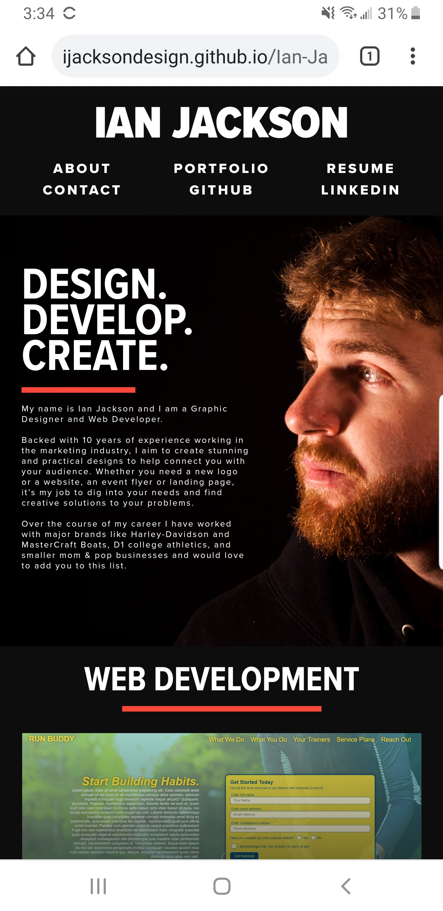

# Ian Jackson Portfolio

## Table of Contents
* [Description](#description)
* [The Challenge](#challenge)
* [The Criteria](#criteria)
* [The Method](#method)
* [Final Result](#results)
* [Reflection](#reflection)

## Description 
This portfolio was created as the second assigment for my coding Bootcamp and was the first project where we weren't given any starter code and had to build it from scratch.

 

## The Challenge 
Create an online portfolio to showcase work samples for potential employers.

## The Criteria 
1. Website has the developer's name, a recent photo, links to different sections, sample of work, and ways to contact the developer
1. UI scrolls to corresponding section when link is clicked
1. Developer's first application is larger than the rest
1. Clicking on images of application, user is taken to the live application
1. Website is responsive and can be viewed on various screensizes

## The Method 
1. **Step 1:** Being a graphic designer, I started by creating mockups of what I wanted my portfolio to look like in Adobe Illustrator. While it's good practice to do a mobile-first approach, I chose to focus on the desktop view first as potential employers would more likely be viewing it on a computer rather than a mobile device.  

1. **Step 2:** After deciding on a look, I created my repository on Github, pulled it to my computer and began structuring the HTML file making sure to use semantic elements and adding comments throughout for better accessibility.   

1. **Step 3:** As I finished a section in HTML, I would jump into the CSS to style the section. I thought this would be an easier approach to diagnose potential code breaking issues as they popped up. 

1. **Step 4:** Once the desktop view was completed, I added several media queries to adjust the layout for smaller screens and mobile devices. 

## Final Result 
The final website can be viewed at [https://ijacksondesign.github.io/Ian-Jackson-Portfolio/](https://ijacksondesign.github.io/Ian-Jackson-Portfolio/)

## Reflection 
Since my time in college, I have been wanting to make the jump from traditional print media to more web/digital based design. I have tried to self-teach myself through codecademy.com, Colt Steele's Web Developer Bootcamp on Udemy, books, and whatever other resources I could find without much success. 

I was nervous to start at first as it would be my first time coding that wasn't a follow-a-long, but I found a lot of the concepts I learned through self-teaching and in the Bootcamp were sticking. I ran into some bumps along the way as expected, but was able to utilize the almost infinite resources online to help me. 

Once I reached the end and I had a functioning, responsive website all I could do was sit back and feel a great wave of pride and joy wash over me. I'm extremely happy with the final result and look forward to building on it as I progress through the rest of the course. 